# Eventos

App em Flutter para a Gestão de Eventos.

Permitindo a visualização, cadastro, alteração e  dos Eventos e Usuários.

Usando a plataforma FlutterFlow com Banco Firebase.

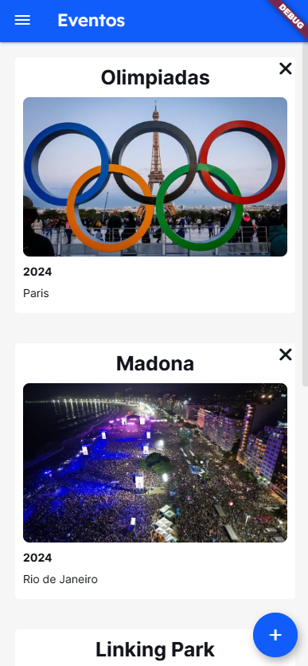 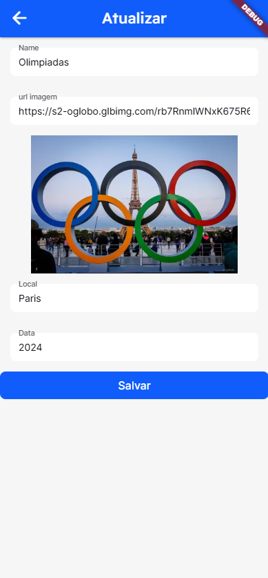

Vídeo de Apresentação:
https://youtu.be/PsS2bCvDCQg

## Telas

Foram criadas 4 telas principais:

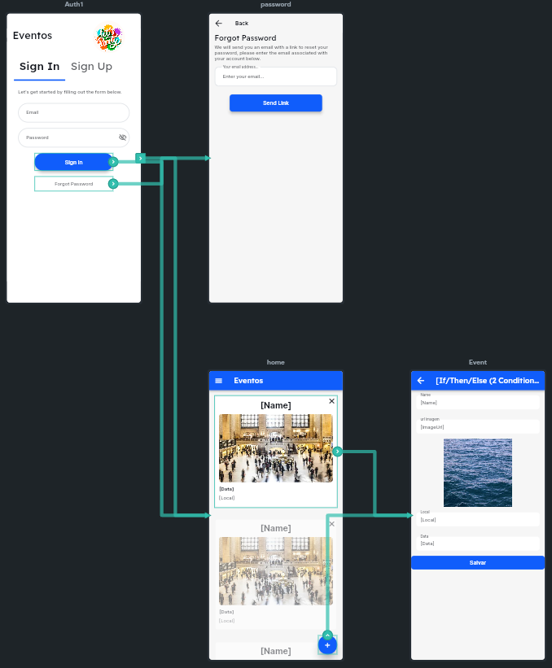

- Home - tela para apresentação dos eventos, com:

  - Cards dos Eventos

  - Drawer

  - Scroll

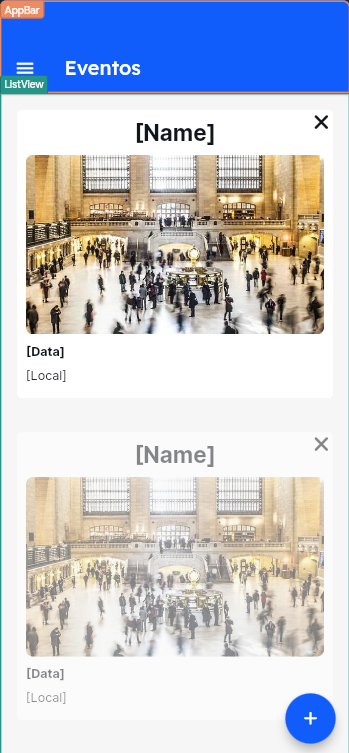

- Event - tela de Cadastro e Edição de Eventos

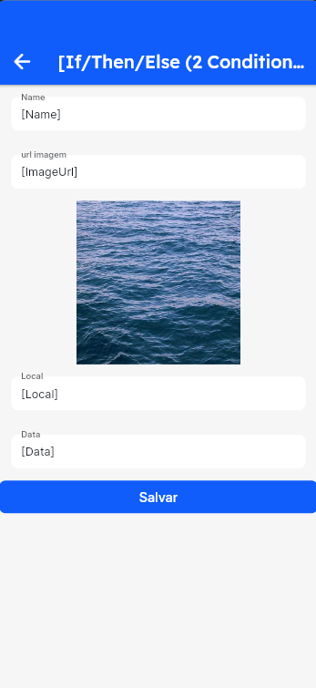

- Auth1 - tela para autenticação dos usuários e cadastro de usuários

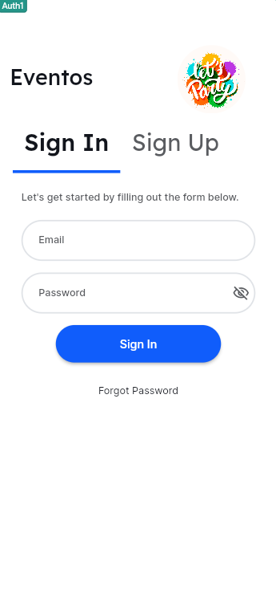     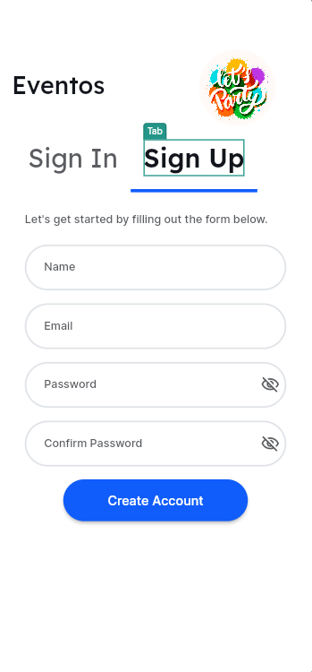

- Password - Tela para reset de password

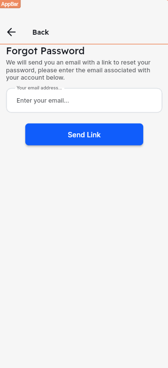

## Colections

Foram criadas 2 colections:

- Eventos

  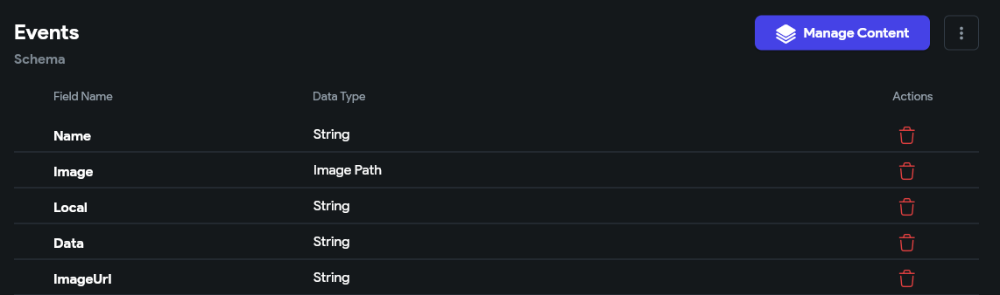

##### Observação: 

Para armazenar as imagens apenas como urls e permitir a edição de imagens no app, na colection de Evento foram criadas duas entradas para as imagens, uma como string e uma como ImagePath.

A edição é feita pela ImagemUrl - string, e a exibição pela Image.

- Users

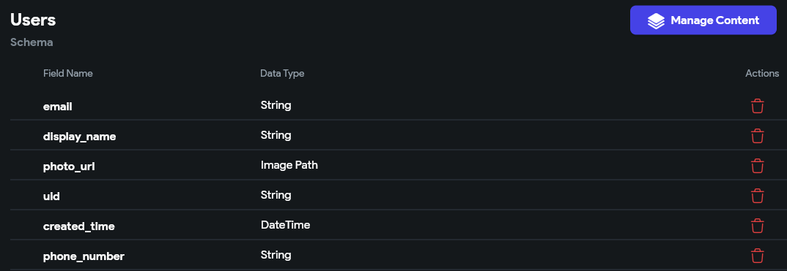

## Lógica e Acionamento

#### Autenticação

- A autenticação Sign In é realizada com email/password, o password é armazenado como hash em banco e só pode ser trocado via link de reset enviado para o email do usuário.
- Caso a pessoa não tenha conta, é possível criar uma conta de usuário através do Sign Up.

- O acesso ao app precisa de autenticação.
- Após a autenticação, abre a tela home.
- Para deslogar clicar em sair na tela Home.

#### Home

Funções básicas:

- Ao clicar no icone:  Abre o Drawer com os dados o nome do usuário e o botão de sair.

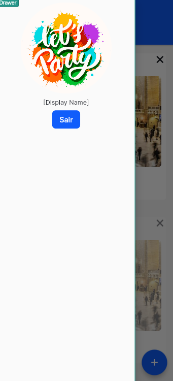

- A lista tem um scroll vertical que permite rodar os cards que não aparecem na tela.
- Ao clicar no ícone  abre a tela de cadastro de Eventos.

- Ao segurar o card, abre a tela de edição do evento.

#### Event

- É a mesma tela para edição e criação de card, a diferença é se recebe ou não o objeto. 

- Dependendo se tem ou não objeto o titulo muda de Novo Evento ou Atualizar.

  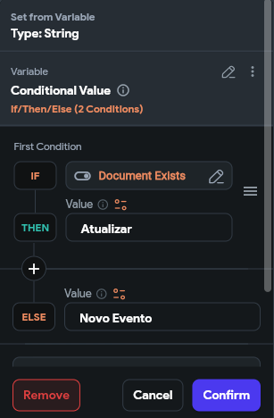

- Em caso de edição: os campos Name, url_imagem, Local e Data são preenchidos a partir do objeto Evento.

- A imagem é renderizada a partir da url definida no campo url imagem.

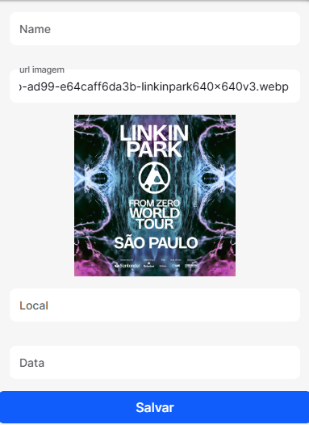

- Ao clicar em retorna para a tela home sem salvar.
- Ao clicar em salvar, existe a lógica para criação ou atualização do Evento, limpar o formulário e retornar a tela home.

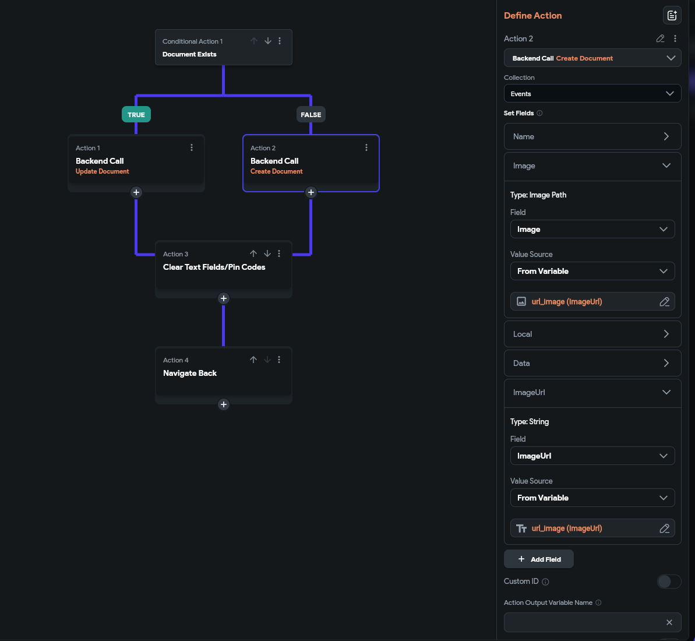

Ao salvar, os dados Imagem e Imagem url são preenchidos com o campo url_imagem.

